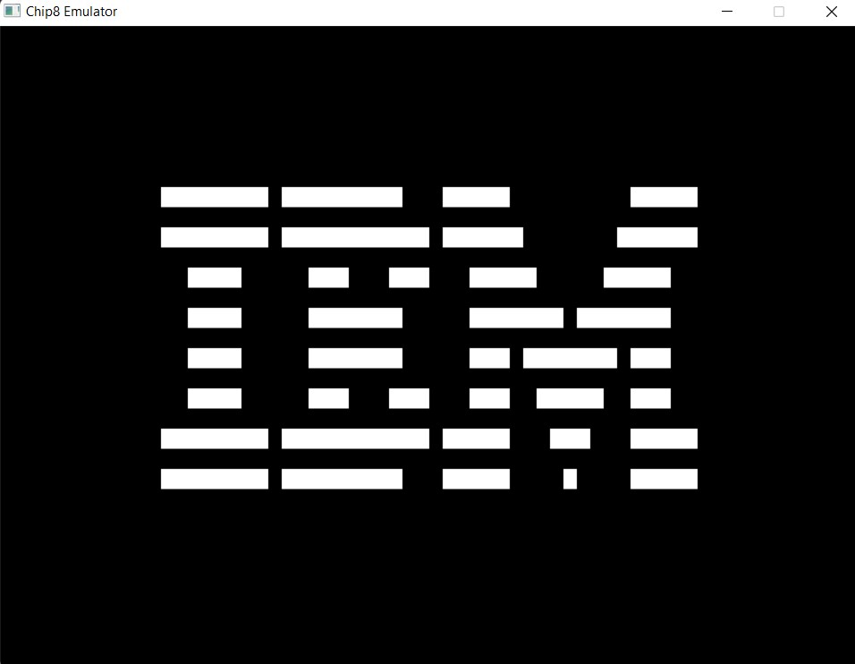

# chip8-emulator

An interpreter that runs chip8 assembly code in an emulated virtual machine based on the original chip8
hardware.

# Running it:
1. Clone the repo
2. Run `cargo build`
3. Run `cargo run <path to chip8 ROM>`

# Reference:
- [Cowgod's Chip8 Specification](devernay.free.fr/hacks/chip8/C8TECH10.HTM)

Here's, a generated image that was written in chip8 and interepreted by the emulator:

# TODO:
- Bug fixes for glitches in interactive games.
